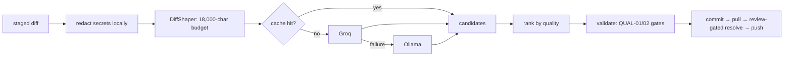

# AI Commit Generator — `aic`

<p align="center"><strong>Stop writing <code>fix stuff</code>. One command stages your changes, writes the commit message, pulls, resolves conflicts, and pushes.</strong></p>

<p align="center">
  
  
  
  
  
</p>

`aic` is a Node.js CLI that generates [Conventional Commit](https://www.conventionalcommits.org/) messages from your diff using **Groq (cloud, default)** or **Ollama (local, private)** — then finishes the workflow around them.

```bash
$ cd my-project && aic

✔ Staged 4 files (src/auth/*.js)
✔ Generated: feat(auth): add PKCE flow to OAuth callback

  Explains the code_verifier challenge exchange and why the
  plaintext secret was removed from the redirect handler.

✔ Pulled origin/main — already up to date
✔ Pushed 8fafeee in 6.2s
```

Prefer to choose? `aic generate` proposes ranked candidates and lets you pick:

```bash
$ aic generate

  1. feat(auth): add PKCE flow to OAuth callback          ████████ 94
  2. fix(auth): repair OAuth redirect handling            ██████   78
  3. refactor(auth): extract code_verifier exchange       █████    71

? Pick a message (1-3):
```

## Contents

- [Why aic?](#why-aic)
- [Quickstart](#quickstart)
- [Usage](#usage)
- [Configuration](#configuration)
- [Providers](#providers)
- [How it works](#how-it-works)
- [Security](#security)
- [Development](#development)
- [Troubleshooting](#troubleshooting)
- [Contributing](#contributing)
- [License](#license)

## Why aic?

Most commit-message tools stop at text generation. `aic` owns the whole loop:

| Step | Typical tool | `aic` |
|---|---|---|
| Stage | you run `git add` | stages tracked modifications itself |
| Message | generates one string | generates **ranked candidates** with scores, grounded in the changed code |
| Quality | hope | every message passes **quality gates** (rejects `fix bug`, requires reasoning) |
| Pull + conflicts | your problem | pulls, and **AI-resolves conflicts block-by-block behind a human review gate** |
| Push | you again | pushes, with `--dry-run` for scripts and hooks |
| Secrets | sent raw | **redacted locally** before any network call; `--enterprise-mode` aborts on any hit |

The result is a `git log` that reads like documentation:

```bash
$ git log --oneline -3
8fafeee docs: modernise README with command reference
a0f152b docs(plans): withdraw rejected god-file-split plan
f20ef11 docs: sync README with current behavior, close audit backlog
```

## Quickstart

**Prerequisites:** Node.js ≥ 18, Git, and (for the default cloud provider) a free [Groq API key](https://console.groq.com/keys).

```bash
# 1. Install
git clone https://github.com/barungrazitti/gitops.git
cd gitops
npm install
./install.sh            # symlink, global install, or npx — your choice

# 2. Configure (either one)
cp .env.example .env    # then set GROQ_API_KEY=gsk_...
aic setup               # ...or use the interactive wizard

# 3. Go
cd your-project && aic
```

No API key and no internet? Install [Ollama](https://ollama.ai/), then `aic config --set defaultProvider=ollama` — everything runs on your machine.

## Usage

Bare `aic` runs the full `auto` workflow. Every flag is optional.

### Automate everything

```bash
aic                        # stage → message → pull → resolve → push
aic "fix the login bug"    # skip AI, commit with your message
aic --dry-run              # preview only — prints the candidate message to stdout
aic --skip-pull            # don't pull before pushing
aic --no-push              # commit locally, don't push
aic --enterprise-mode      # abort if ANY secret/PII is detected (no redact-and-continue)
aic -f                     # run even when no changes are detected
aic -p ollama              # one-off provider override
```

`--dry-run` is pipe-friendly for hooks and scripts: `aic --dry-run | head -1`.

### Generate a message, nothing else

```bash
aic generate                  # rank 3 candidates for staged changes, pick interactively
aic generate -c 5             # rank 5 instead
aic generate --conventional   # enforce conventional-commit format
aic generate --dry-run        # print candidates without committing
```

### Everyday commands

| Command | Purpose |
|---|---|
| `aic setup` | Interactive provider + model wizard |
| `aic config --list` | Show config (API key masked) |
| `aic config --set <key=value>` | e.g. `defaultProvider=ollama`, `language=es`, `model=llama-3.3-70b-versatile` |
| `aic config --get <key>` | Read one value (dot notation supported) |
| `aic config --reset` | Restore defaults |
| `aic stats` | Usage statistics |
| `aic stats --analyze --days 7` | Recent activity analysis (default window: 30 days) |
| `aic stats --export --format json` | Export detailed logs (`json` or `text`) |
| `aic hook --install` / `--uninstall` | Manage the `prepare-commit-msg` hook |
| `aic --verbose` | Console debug logs (default: log file only, under `.aic-logs/`) |

Full flags: `aic <command> --help`.

## Configuration

Precedence, highest first: **CLI flags → environment / `.env` → stored config → built-in defaults.**

| Variable | Default | Purpose |
|---|---|---|
| `GROQ_API_KEY` | — | Groq API key (required for the `groq` provider) |
| `AIC_PROVIDER` | `groq` | `groq` or `ollama` |
| `AIC_MODEL` | `openai/gpt-oss-20b` | Any Groq model id, or a local Ollama model name |

```bash
# .env — see .env.example
GROQ_API_KEY=gsk_...
AIC_MODEL=openai/gpt-oss-20b
AIC_PROVIDER=groq
```

Frequently tuned stored settings (`aic config --set key=value`):

| Key | Default | Notes |
|---|---|---|
| `model` | Groq default | Override per provider |
| `language` | `en` | Commit-message language: `en es fr de zh ja` |
| `conventionalCommits` | `true` | Conventional-commit formatting |
| `cache` | `true` | Reuse messages for identical diffs |
| `sanitize` | `true` | Redact secrets/PII before any AI call (leave on) |
| `maxTokens` / `temperature` | `150` / `0.7` | Generation tuning (reasoning models get an automatic token floor) |
| `retries` / `timeout` | `3` / `120s` | Provider resilience |

Stored config lives in your OS-backed config store with `0600` permissions; `.env` values override it without ever being persisted there.

## Providers

| | **Groq** (default) | **Ollama** (local) |
|---|---|---|
| Setup | Key from [console.groq.com/keys](https://console.groq.com/keys) | Install from [ollama.ai](https://ollama.ai/), run `ollama serve` |
| Best for | Speed and message quality | Privacy, offline use, no API key |
| Default model | `openai/gpt-oss-20b` (reasoning — token budget raised automatically) | whichever model you pulled |
| Other options | `llama-3.1-8b-instant`, `llama-3.3-70b-versatile`, `qwen/qwen3-32b` | any local model via `model=<name>` |
| Select | `AIC_PROVIDER=groq` or `aic setup` | `aic config --set defaultProvider=ollama` |

If Groq fails, `aic` falls back to Ollama automatically when it's available. A circuit breaker stops hammering a failing provider, and identical diffs are served from cache without a network call.

## How it works



Three decisions shape the whole design:

1. **One module owns the diff budget.** `src/core/diff-shaper.js` is the only code that truncates or chunks diffs — file headers survive, high-signal hunks win. Prompts and providers never second-guess it.
2. **Conflicts need a human.** AI resolves merge conflicts block-by-block, then shows each resolution for accept / set-aside / discard. Nothing conflict-related is staged silently.
3. **Messages are grounded, not guessed.** Scopes come from the changed files, empty trailers are stripped, and binary-only diffs are described locally without spending a model call.

## Security

Redaction happens **on your machine, before** any bytes go to a provider:

| Category | Coverage |
|---|---|
| Secrets (15+ patterns) | API keys, tokens, passwords, SSH keys |
| PII (8 patterns) | Emails, phones, SSNs, addresses, credit cards |

- `--enterprise-mode` aborts the commit on **any** detection instead of redacting and continuing.
- API keys are masked in console output, logs, and `config --list`. Stored config files are written with `0600` permissions.

## Development

```bash
npm install                         # dependencies
npm test                            # Jest — 527 tests, 30 suites
npx jest tests/auto-git.test.js     # one file
npm run test:coverage               # with coverage
npm run lint                        # ESLint — must report 0 errors, 0 warnings
```

CI runs on Node 18 and 22 (`lint` → `tests` → version smoke test).

```
src/
├── index.js            # generation-pipeline orchestrator
├── auto-git.js         # stage / commit / pull / resolve / push workflow
├── cli-presenter.js    # console UI
├── core/               # diff-shaper, generation-pipeline, conflict-resolver,
│                       # message ranker / validator / formatter, git, config,
│                       # cache, analysis, stats, activity-log, hook, circuit-breaker
├── providers/          # base + groq + ollama + factory
└── utils/              # secret-scanner, prompt-builder, sanitizers, scorers
bin/
├── aic                 # shell shim
└── aic.js              # CLI entry point and composition root
tests/                  # Jest suites mirroring src/
```

Conventions: CommonJS `require()`, `PascalCase` classes, `camelCase` methods, `kebab-case` files, JSDoc on public methods, `async/await` (no promise chains). Agent-oriented architecture notes live in [AGENTS.md](AGENTS.md); the project's change history is tracked in [plans/](plans/).

## Troubleshooting

<details>
<summary><code>aic: command not found</code></summary>

Re-run `./install.sh` (option 1 creates `~/.local/bin/aic`), make sure `~/.local/bin` is on your `PATH`, or invoke directly with `node bin/aic.js …`.

</details>

<details>
<summary>Groq returns empty responses</summary>

Reasoning models (`gpt-oss-*`) need a larger token budget — the tool raises it automatically. If it persists, verify with `aic config --list`, or try a non-reasoning model via `AIC_MODEL=llama-3.1-8b-instant`.

</details>

<details>
<summary>Ollama connection errors</summary>

```bash
ollama serve                          # must be running
curl http://localhost:11434/api/tags  # should list your models
```

</details>

## Contributing

Issues and PRs are welcome. Please run `npm test` and `npm run lint` before submitting, and follow the conventions in [AGENTS.md](AGENTS.md) (Conventional Commits, JSDoc, tests for new behavior).

## License

MIT — see [LICENSE](LICENSE).

_Made by [Barun Tayenjam](https://github.com/barungrazitti)_
